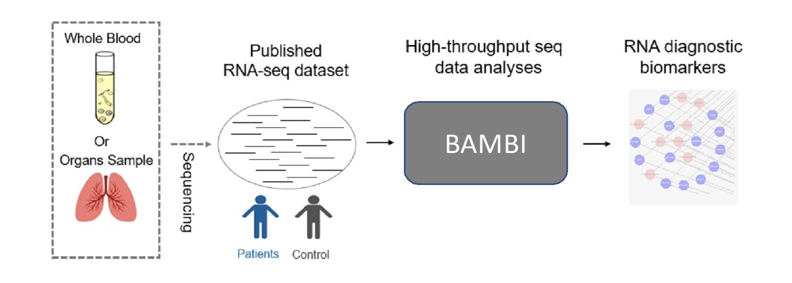
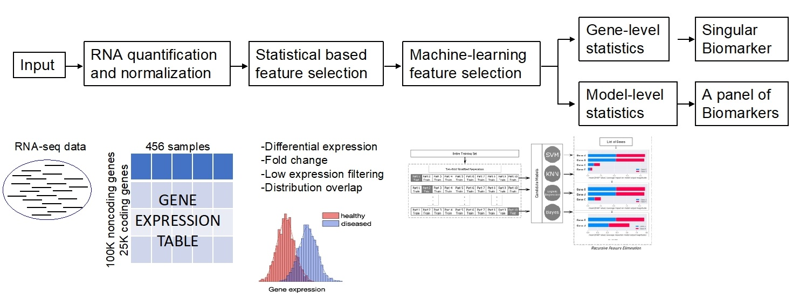

# BAMBI: Integrative biostatistical and artificial-intelligence models discover coding and noncoding RNA genes as biomarkers

## Introduction

BAMBI (Biostatistics and Artificial-Intelligence integrated methods for Biomarker detection), to identify coding and non-coding RNA biomarkers for diagnosis and prognosis. BAMBI is a comprehensive RNA biomarker detection pipeline which can directly process RNA-seq data or microarray data without pre-processing and manually imputation. Compared to other methods, BAMBI and identify a small number of RNA biomarkers while still have a higher prediction performance than other methods. Thus, the putative biomarkers identified by BAMBI would have more easily adapted in clinical practice.

Authors: Peng Zhou (peng.zhou@umassmed.edu), Chan Zhou (chan.zhou@umassmed.edu)

Maintainer: Peng Zhou

## Prerequisites

To use BAMBI, you will need the following programs in your PATH:

•       python3 (>=3.7.3) 

•       python packages:
•       	numpy
•       	pandas
•       	scikit-learn (>=0.22.1)
•       	kdepy (conda install -c dmentipl kdepy)
•       	shap (conda install -c conda-forge shap)

•       R (>=3.7.3) 

•       R packages:
•       	edgeR
•       	limma
•       	impute
•       	GenomicFeatures (if you need to use customize annotation GTF file)

    
•       Softwares required for RNA-seq data preprocessing
•       htseq (>=0.6.1)
•       pysam (>=0.8.4)
•       hisat2 (>=2.0.5)
•       sambamba (>=0.6.8)

•       OS: high performance computing cluster in Linux (suggested)

## Usage

## 0.RNASeq_Preprocessing.py

it needs to input a table which includes the sequecning files information, relative sample files provided: 

•       "sample_name"

•       Catergory information: "Label" ("C" for Control and "T" for "Treatment")

•       Sequencing file path ("unpaired_input" for Single-End, and "R1_input" & "R2_input" for Paired-End)

•       Strandness information "Strandness" (""first", "second" or "unstrand")

### Parameter:

•       target biomarker gene type: "gene_type": ("protein_coding" or "lincRNA" or both)

•       sequence files type: "sequence_type": ("Single" or "Paired")

•       annotation file usage: "annotation_file": ("LncBook_Version2.0_all","gencode_v22", "gencode_v29", "gencode_v37", or any path to your customized gtf)

•       path to your sequecning files information table: "inputCSV": ("protein_coding" or "lincRNA" or both)

## 1.statitical_based_feature_selection_info_generation.py

it will generate a statitical metrics table for each genes, include: 

•       "pvalue": pvalue from selected differential expression analysis

•       "padj": adjust pvalue from selected differential expression analysis

•       "abs(log2(fold-change))": fold change from Fold Change analysis 

•       "max_val": the maximum expression in all sample, used for Low-Expression Genes Filter  

•       "overlap_area": between-group estimate distribution overlap area

User can use this table to select thresholds for different metrics.

### Parameter:

•       target biomarker gene type: "gene_type": ("protein_coding" or "lincRNA")

## 2.statitical_based_feature_selection_gene_filter.py

### Parameter:

•       target biomarker gene type: "gene_type": ("protein_coding" or "lincRNA")

## 3_machine_learning_based_feature_selection_10CV.py

### Parameter:

•       target biomarker gene type: "gene_type": ("protein_coding" or "lincRNA")

•       self-defined dataset name: "dataset_name": (any customized name)

## 4_result_collection.py

### Parameter:

•       target biomarker gene type: "gene_type": ("protein_coding" or "lincRNA")

•       self-defined dataset name: "dataset_name": (any customized name)

